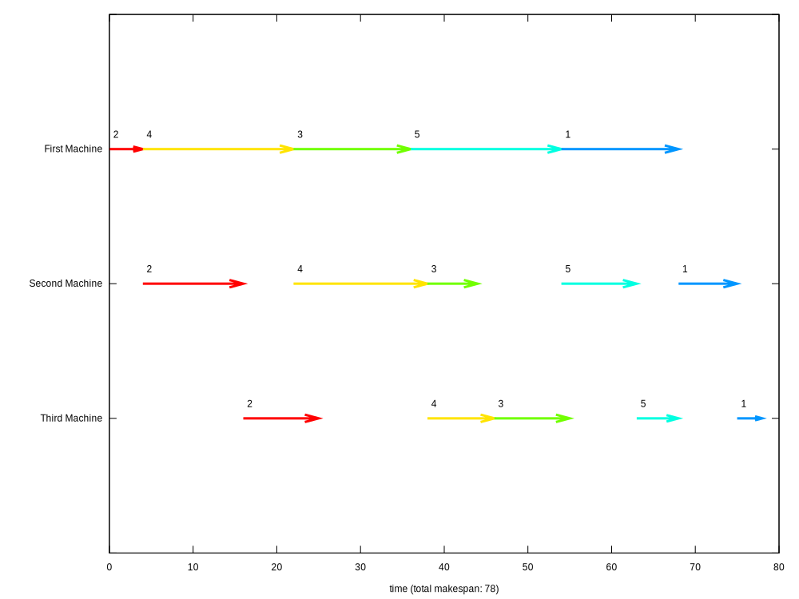

# README
Brute force algorithm comparison to Johnson's algorithm for solving two and three machine flowshop problem

Tasks are created in loop. Values of Mx (where x is machine number) are generated randomly,
they represent time needed for x machine to process task.
Computation time available for later comparison.

You may want to change:
1. Number of tasks by changing `TASK_COUNT`
2. Minimal time for machine by changing `MIN_TIME`
3. Maximal time for machine by changing `MAX_TIME`
4. You can save some time by turning of `SHOW_PERMUTATIONS`
5. To `GENERATE_PLOT` You will need `gnuplot`
6. I used `GENERATE_TEST_DATA` to generate below tables

###Test times

#####Two Machines
| Number of tasks: |Johnson's algorithm |make span | Brute force | make span|
| ------------- |-------------:| -----:| -----:| -----:|
|2|0.007 ms|19|0.006 ms|19|
|3|0.007 ms|37|0.01 ms|37|
|4|0.007 ms|52|0.014 ms|52|
|5|0.007 ms|61|0.036 ms|61|
|6|0.009 ms|72|0.192 ms|72|
|7|0.008 ms|59|1.386 ms|59|
|8|0.013 ms|98|11.962 ms|98|
|9|0.015 ms|86|138.003 ms|86|
|10|0.014 ms|107|1369.05 ms|107|
|11|0.017 ms|124|16103.2 ms|124|
|12|0.014 ms|123|198605 ms|123|

#####Three Machines
| Number of tasks: |Johnson's algorithm | make span | Brute force | make span|
| ------------- |-------------:| -----:| -----:| -----:|
|2|0.002 ms|35|0.008 ms|35|
|3|0.003 ms|56|0.006 ms|56|
|4|0.002 ms|61|0.012 ms|59|
|5|0.003 ms|72|0.038 ms|72|
|6|0.004 ms|85|0.217 ms|76|
|7|0.004 ms|71|1.761 ms|71|
|8|0.005 ms|106|15.545 ms|102|
|9|0.006 ms|98|168.383 ms|93|
|10|0.006 ms|124|1814.9 ms|124|
|11|0.006 ms|134|19637.4 ms|131|
|12|0.006 ms|129|249579 ms|126|

###Visualisation
I'm using `gnuplot` to visualise chosen task order.

Example visualisation for three machines:

###Summary
Johnson's algorithm is significantly faster than brute force and gives the same results as brute force.
Three machines version of Johnson's algorithm is not perfect but it is close enough for the time savings.

*for SPD lab pt11 on PWR*
